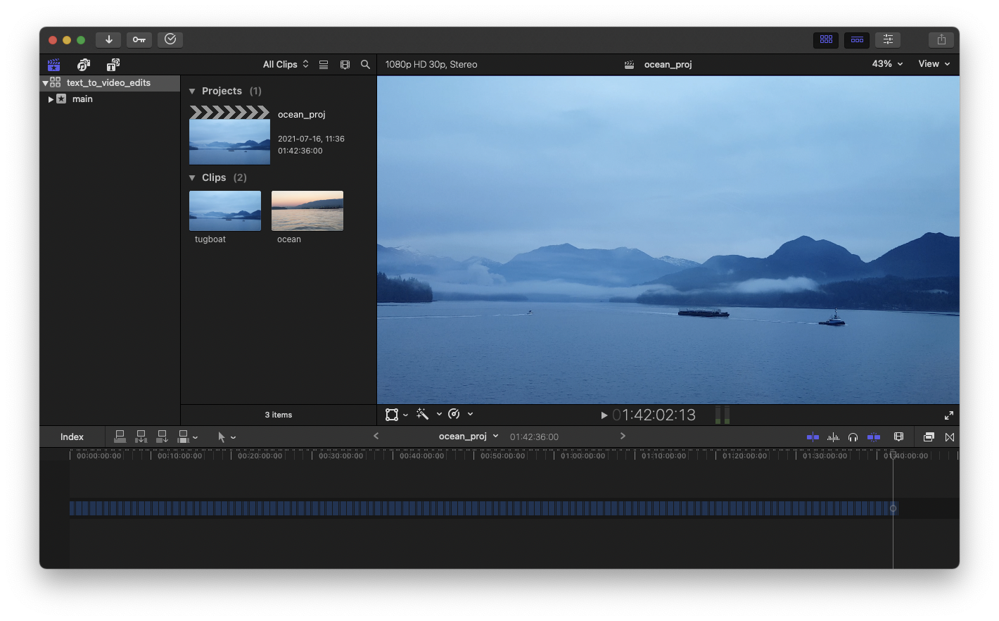
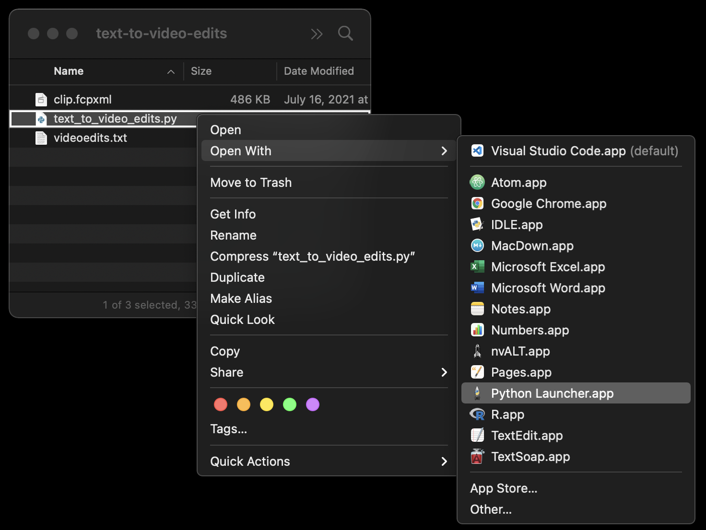

# Text to video edits - FinalCut Pro

This python file cuts a **video clip** based on **human-written instructions** inside the FinalCut Pro video editor.

See **Jupiter notebook** [text_to_video_edits.ipynb](https://github.com/DmytroNorth/Text_To_Video_Edits-fcp/blob/main/text_to_video_edits.ipynb) for detailed presentation.

## 1. Table of Contents

- [Text to video edits - FinalCut Pro](#text-to-video-edits---finalcut-pro)
  - [1. Table of Contents](#1-table-of-contents)
  - [2. Description](#2-description)
    - [2.1 Problem](#21-problem)
    - [2.2 Solution](#22-solution)
    - [2.3 Motivation behind the project](#23-motivation-behind-the-project)
    - [2.4 Development history](#24-development-history)
  - [3. Technologies Used](#3-technologies-used)
  - [4. Installation](#4-installation)
  - [5. Usage](#5-usage)
    - [5.1 Prepare and export .fcpxml file](#51-prepare-and-export-fcpxml-file)
      - [5.1.1 Create new project](#511-create-new-project)
      - [5.1.2 Create and cut compound clip](#512-create-and-cut-compound-clip)
      - [5.1.3 Export XML](#513-export-xml)
    - [5.2 Prepare .txt file](#52-prepare-txt-file)
      - [5.2.1 Write text instructions](#521-write-text-instructions)
      - [5.2.2 Rename and move .txt file](#522-rename-and-move-txt-file)
    - [5.3 Launch Python script](#53-launch-python-script)
    - [5.4 Open export.fcpxml with FinalCut Pro](#54-open-exportfcpxml-with-finalcut-pro)
  - [6. Project Status](#6-project-status)
  - [7. Known Limitations](#7-known-limitations)
  - [8. Room for Improvement](#8-room-for-improvement)
  - [9. License](#9-license)
  - [10. Contact](#10-contact)

<!-- * [License](#license) -->

## 2. Description

### 2.1 Problem

In a fast-paced TV/Film production environment **Video Editors** often receive Editor's notes in a **text format**. The notes would normally specify which parts of a video clip to leave and which to delete in a free form like:

```
00:01:02 good shot from here... to here 00:03:35
4:05 include this until 5:56
```
In the case of Documentary films or long interviews, the length of the footage and hence the notes can be very long.

### 2.2 Solution

Instead of **manually selecting** these clips in Video Editing Software or copy-pasting the timecode **one timecode at a time** this script **automatically edits a single compound clip** inside FinalCut Pro based on Editor's notes, therefore, increasing productivity, precision, and eliminating mistakes.

### 2.3 Motivation behind the project

I first created this workflow when I was Directing and Video Editing TV mini-series. Since deadlines were extremely tight I was looking at every opportunity to speed up the delivery times while maintaining high quality. This solution fits my workflow very well and has proven to be very useful.

### 2.4 Development history

It was originally built simply by using a stack of **regular expressions** executed in the TextSoap.app along with some operations in Excel and copy-pasting the code manually. Later most of the steps were combined in a single Python script that is presented here.

## 3. Technologies Used

* **`Python 3.9.4`**
* **`pandas 1.2.5`** data analysis and manipulation tool
* **`re`** integrated regular expression operations module
* **`os`** a portable way of using operating system dependent functionality


## 4. Installation

1. Download **`text_to_video_edits.py`** file from this GitHub repository.
2. Install `pandas` module for Python. You can try it with **Terminal** apр through downloading and installing [Anaconda](https://www.anaconda.com/products/individual#macos). It will contain `pandas`
3. *(Optional)* Download and install the latest version of [Python](https://www.python.org/downloads/macOS). It will include **Python Launcher.app** to easily execute python scripts.

## 5. Usage

### 5.1 Prepare and export .fcpxml file

#### 5.1.1 Create new project

In FinalCut Pro **create a new project** and load clips into the timeline. Here I am duplicating the same clips to make the project over one hour long.


#### 5.1.2 Create and cut compound clip

Now `Select all`, choose `File -> New -> Compound Clip`, and make at least one cut of the newly created compound clip. 

#### 5.1.3 Export XML

Choose `File -> Export XML`. Rename it to **`clip.fcpxml`** and save it in the same folder with `text_to_video_edits.py` file.


### 5.2 Prepare .txt file

#### 5.2.1 Write text instructions

**Write instructions** on how you want to cut the clip. The text:

- Must contain at least **two timecodes in the same line** either in `hh:mm:ss` or `mm:ss` format.
- **May contain text** which will be discarded.
- Lines with **less than two timecodes** will be discarded.
- Lines with **more than two timecodes** will use the first two and discard others.

Here is a **sample** used in this project:

```
00:25 Starts speaking here… Ends speaking here 01:02
02:38 Leave this part - Nice action after 3 seconds. Ends here 03:7
the beginning is at 04:17 up to 4:31 including the action
this line without timecode will be discarded
this line with a single time code 05:48 will also be discarded
from 1:4:40 to 01:4:48
```

As you can see the formatting can be quite loose.

#### 5.2.2 Rename and move .txt file

Paste the text into a text editor, then save it as `videoedits.txt`, and move the file into the same folder `with clip.fcpxml` and `text_to_video_edit.py`.

### 5.3 Launch Python script

Before proceeding with the next step make sure you have `pandas` ([Anaconda](https://www.anaconda.com/products/individual#macos)) installed.

Open **Terminal.app**. Type `python`, add `space`, then drag and drop `text_to_video_markers.py` and press `Return`.


Alternatively, you can install the latest version of [Python](https://www.python.org/downloads/macOS). Right-click on `text_to_video_markers.py` file and choose `Open with -> Python Launcher.app`.



Either method will run a python script and create `export.fcpxml` file in the same folder.

### 5.4 Open export.fcpxml with FinalCut Pro

Select newly created `export.fcpxml` file and `Open with -> FinalCut Pro`. Upon opening choose the original library, then `Keep Both`. This will create the second project with the `your_original_name_1` that will include all the edits specified in `videoedits.txt`.

**That's it!** We have just automatically edited a compound clip inside FinalCut Pro based on human-written text instructions.


## 6. Project Status

The project is: **_complete_**
I am no longer working on it since I am not working for TV any longer. But if you have some ideas or want me to modify something [contact me](#contact) and we should be able to collaborate.

## 7. Known Limitations

* Tested on **Mac OS** only.
* The script only runs with `pandas` module (**Anaconda**) installed.
* Input files must be named **`clip.fcpxml`** and **`videoedits.txt`**.
* `videoedits.txt` file must contain at least **two timecodes** in the same line.
* The `clip.fcpxml` project must contain one or more **compound clips**.
* The compound clip must have one or more **cuts**.
* All three files (`text_to_video_edits.py`, `clip.fcpxml`, `videoedits.txt`) must be located in the **same folder**.

## 8. Room for Improvement

* **Testing** and logging the issues.
* Adding support for cutting a **single clip** (as opposed to a compound clip).
* adding support for cutting **multiple** distinct compound and regular clips.
* Making an **executable file** without the need to install `pandas` (Anaconda).
* **Developing GUI** to be able to specify `.txt` and `.fcpxml` input files with any name and location.
* Building a **web app**.
* Designing a **report** listing the lines (with less than two timecodes) that have been **discarded**.
* Designing **error message** when end timecode is smaller than start timecode.

## 9. License

This project is open-source and available under the [GNU General Public License v3.0](https://choosealicense.com/licenses/gpl-3.0/#)

## 10. Contact

Created by [@DmytroNorth](https://github.com/DmytroNorth) - feel free to contact me at dmytronorth@gmail.com!
