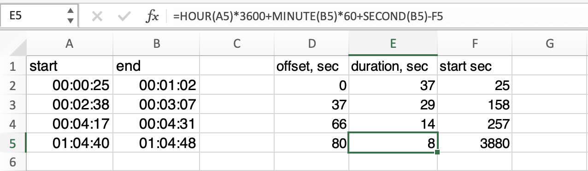
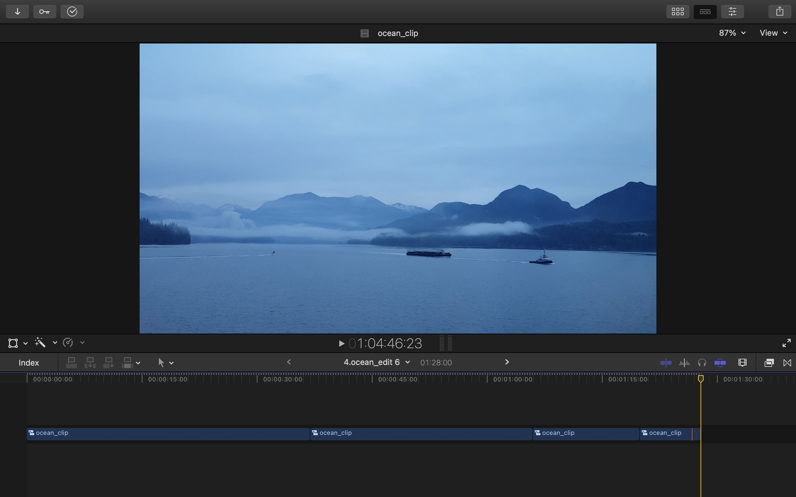

## Text cleanup
### Original text 
```
No comfort… 0:25 Scarcely 5… cease too the decay 01:2
2:38 She did open… greatly 14 removed 03:07 
04:17 So passage… determine by 4:31 resolution
1:4:40 Covered parlors… lively letter 01:04:48
```

Finds timecode and wrap with special symbols "~" and "#"

```
FIND: (\d{1,2}:\d{1,2}:\d{1,2}|\d{1,2}:\d{1,2})
REPLACE: ~$1#
```
**Output:**

```
No comfort… ~0:25# Scarcely on striking 5… cease too the decay ~01:2#
~2:38# She did open… greatly 14 removed ~03:07# 
~04:17# So passage… determine by ~4:31# resolution
~1:4:40# Covered parlors… lively letter ~01:04:48#
```


Strip text between # and ~

```
FIND: (?s)(?<=#).*?(?=~)
REPLACE:
```
**Output:**

```
No comfort…
~0:25#~1:2#~2:38#~03:07#~04:17#~4:31#~1:4:40#~01:04:48#
```


Remove text from beginning to ~

```
FIND: (?s)(?<=^).*?(?=~)
REPLACE:
```
**Output:**

```
~0:25#~1:2#~2:38#~03:07#~04:17#~4:31#~1:4:40#~01:04:48#
```

Add '00' hours

```
FIND: (~)(\d{1,2}:\d{1,2}\#)
REPLACE: $100:$2
```
**Output:**

```
~00:0:25#~00:1:2#~00:2:38#~00:03:07#~00:04:17#~00:4:31#~1:4:40#~01:04:48#
```

Add 0 to single digit hours

```
FIND: (~)(\d:\d{1,2}:\d{1,2}\#)
REPLACE: $10$2
```
**Output:**

```
~00:0:25#~00:1:2#~00:2:38#~00:03:07#~00:04:17#~00:4:31#~01:4:40#~01:04:48#
```

Add 0 to single digit minutes

```
FIND: (~\d{1,2}:)(\d:\d{1,2}#)
REPLACE: $10$2
```
**Output:**

```
~00:00:25#~00:01:2#~00:02:38#~00:03:07#~00:04:17#~00:04:31#~01:04:40#~01:04:48#
```

Add 0 to single digit seconds

```
FIND: (~\d{1,2}:\d{1,2}:)(\d#)
REPLACE: $10$2
```
**Output:**

```
~00:00:25#~00:01:02#~00:02:38#~00:03:07#~00:04:17#~00:04:31#~01:04:40#~01:04:48#
```


Linebreaks

```
FIND: ~(\d{2}:\d{2}:\d{2})#
REPLACE: $1\n
```
**Output:**

```
00:00:25
00:01:02
00:02:38
00:03:07
00:04:17
00:04:31
01:04:40
01:04:48
```

Group in doubles

```
FIND: (\d+:\d+:\d+)\n(\d+:\d+:\d+)
REPLACE: $1\t$2
```
**Output:**

```
00:00:25	00:01:02
00:02:38	00:03:07
00:04:17	00:04:31
01:04:40	01:04:48
```
**sample**

```
<spine>
	<ref-clip name="ocean_clip" offset="0/3000s" ref="r2" duration="111000/3000s" start="75000/3000s"/>
	<ref-clip name="ocean_clip" offset="111000/3000s" ref="r2" duration="87000/3000s" start="474000/3000s"/>
	<ref-clip name="ocean_clip" offset="198000/3000s" ref="r2" duration="42000/3000s" start="771000/3000s"/>
	<ref-clip name="ocean_clip" offset="240000/3000s" ref="r2" duration="24000/3000s" start="840000/3000s"/>
</spine>
```
w

```<ref-clip name="ocean_clip" offset="0/3000s" ref="r2" duration="111000/3000s" start="75000/3000s"/>```



```
offset=D2+E2
duration==HOUR(A2)*3600+MINUTE(B2)*60+SECOND(B2)-F2
start==HOUR(A2)*3600+MINUTE(A2)*60+SECOND(A2)
```
```
0	37	25
37	29	158
66	14	257
80	8	3880
```

```
FIND: (\d+)\t(\d+)\t(\d+)
REPLACE: <ref-clip name="ocean_clip" offset="$1s" ref="r2" duration="$2s" start="$3s"/>
```
**Output:**

```
<ref-clip name="ocean_clip" offset="0s" ref="r2" duration="37s" start="25s"/>
<ref-clip name="ocean_clip" offset="37s" ref="r2" duration="29s" start="158s"/>
<ref-clip name="ocean_clip" offset="66s" ref="r2" duration="14s" start="257s"/>
<ref-clip name="ocean_clip" offset="80s" ref="r2" duration="8s" start="3880s"/>
```



